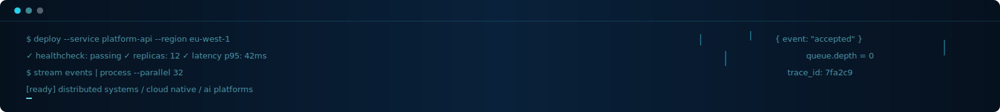

  

  
  &nbsp;&nbsp;
  

## About

I’m a Senior Backend & Data Engineer with 8+ years of experience designing distributed systems, cloud-native architectures, AI platforms, and large-scale data infrastructure.

My career spans autonomous driving, robotics, e-commerce, and AI, from ROS2 autonomous robotics software to AWS event-driven platforms processing more than 120 TB per day of LiDAR, radar, and camera data.

I enjoy solving complex engineering challenges with a focus on scalability, reliability, and maintainability, building production-ready systems that are straightforward to operate and evolve.

## Current Focus

| Area | Focus |
| --- | --- |
| 🤖 AI | Amazon Bedrock, LLM integration |
| ⚙️ Backend | FastAPI, event-driven systems |
| ☁️ Cloud | AWS serverless platforms |
| 📊 Data | Spark, Airflow |

## Experience

| Company | Role | Core technologies | Period |
| --- | --- | --- | --- |
| [Jaguar Land Rover](https://www.jaguarlandrover.com/) | Senior Backend Engineer | AWS • FastAPI • Event-Driven | Apr 2026 to Present |
| [BMW Group](https://www.bmwgroup.com/) | Senior Data Engineer | AWS • Spark • Lambda • PySpark | May 2025 to Apr 2026 |
| Wypoon Technologies | Senior Software Engineer | Python • Backend Systems • Cloud | Oct 2024 to Apr 2025 |
| [Milvus Robotics](https://milvusrobotics.com/) | Senior Software Engineer | C++ • ROS2 • Distributed Robotics | Jan 2021 to Mar 2023 |
| [Hepsiburada](https://www.hepsiburada.com/) | Software Engineer | Python • APIs • E-commerce Platforms | Jan 2019 to Jan 2021 |
| Buckberry Studios | Software Engineer | JavaScript • Backend Services | Aug 2017 to Jan 2019 |

## Tech Stack

<table>
  <tr><td width="165"><strong>Languages</strong></td><td align="center" width="115"> Python</td><td align="center" width="115"> C++</td><td align="center" width="115"> TypeScript</td><td align="center" width="115"> JavaScript</td><td width="115"></td></tr>
  <tr><td><strong>Backend</strong></td><td align="center"> FastAPI</td><td align="center"> Django</td><td align="center"> Node.js</td><td align="center"> RabbitMQ</td><td align="center"> Pytest</td></tr>
  <tr><td><strong>Cloud</strong></td><td align="center"> AWS</td><td align="center"> Docker</td><td align="center"> Kubernetes</td><td align="center"> Terraform</td><td></td></tr>
  <tr><td><strong>Databases</strong></td><td align="center"> PostgreSQL</td><td align="center"> MySQL</td><td align="center"> DynamoDB</td><td></td><td></td></tr>
  <tr><td><strong>Data Engineering</strong></td><td align="center"> Spark</td><td align="center"> Airflow</td><td></td><td></td><td></td></tr>
  <tr><td><strong>DevOps</strong></td><td align="center"> Linux</td><td align="center"> Git</td><td align="center"> GitHub Actions</td><td></td><td></td></tr>
</table>

## Career Highlights

- Designed and productionized an AWS event-driven ADAS platform processing more than 120 TB of sensor data each day.
- Reduced diagnostic feedback time from six hours to under six minutes through automated data workflows.
- Delivered 20 to 40% infrastructure cost and latency improvements across production services.
- Designed cloud-native services with Lambda, ECS, Step Functions, EventBridge, DynamoDB, and S3.
- Designed Amazon Bedrock-powered engineering workflows for production AI use cases.

  <em>“Great software isn't just scalable, it's simple, reliable, and built to last.”</em>

  

  

